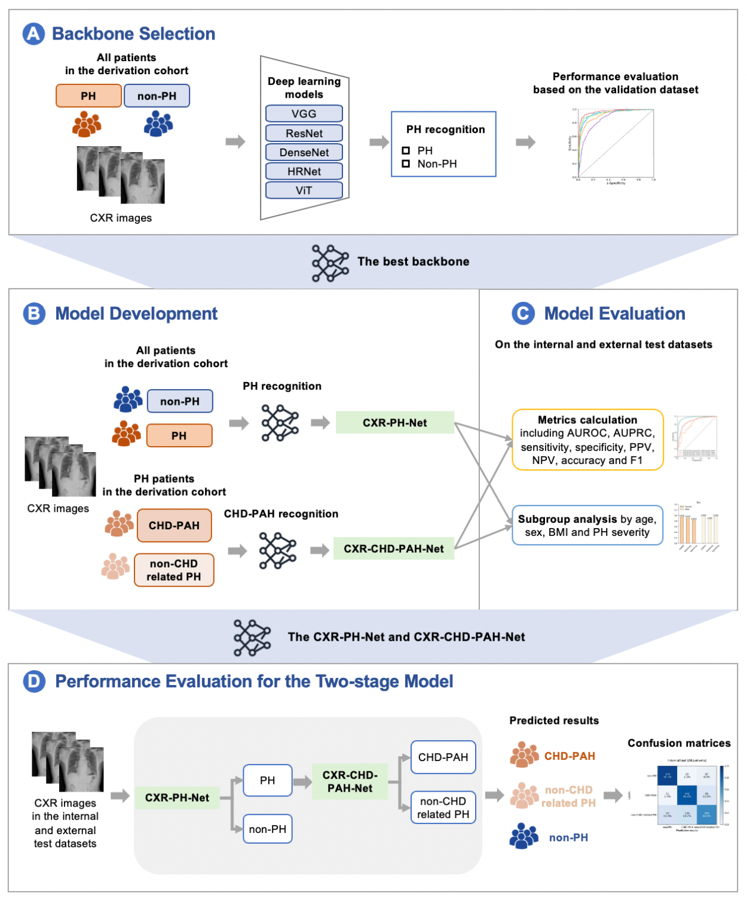

# Deep Learning-Enhanced Non-Invasive Detection of Pulmonary Hypertension and Subtypes via Chest Radiographs, Validated by Catheterization

- [Introduction](#introduction)
- [Usage](#usage)
- [Citing](#citing)
- [Acknowledgement](#acknowledgement)

## Introduction
 CXR-PH-Net and CXR-CHD-PAH-Net demonstrate high sensitivity as screening tools for PH and CHD-PAH, potentially facilitating early detection and triage for further evaluation, particularly in resource-limited settings. However, RHC remains essential for definitive diagnosis, and further validation in diverse populations is needed to confirm generalizability.



## Usage
### 1. Install Instructions
(Recommended) Install requirements, with Python 3.8 or higher, using pip3.

```bash
pip3 install -r requirements.txt
pip3 install -r requirements-dev.txt
```

### 2. Prepare the dataset
We have converted them into txt format,Extract them under {ROOT}/data, your directory tree should look like this:

```
${ROOT}/data
├── imgs
|   |—— 0.dcm
└── |—— 1.dcm
    |—— ...   
|—— train.txt
|—— val.txt
|—— test.txt

```
### 3. Train
#### Sample single-process running code:
```bash
python train.py /CXR-PH-Net/data \
    --train_file train.txt \
    --val_file val.txt \
    --model vgg16 \
    --epochs 500 \
    --batch-size 24 \
    --validation-batch-size 24 \
    --lr 0.001 \
    --sched cosine \
    --num-classes 2 \
    --input-size 3 1024 1024 \
    --output /CXR-PH-Net/results/ \
```
### 3. Inference
We can run the following code, and the model prediction results will be saved in JSON format.
```bash
python inference.py \
    --data-dir /path/to/test/ \
    --model-name vgg16 \
    --num-classes 2 \
    --model-path /path/to/modelcheckpoint/*.pt \
    --use-gpu True \
    --save-path /CXR-PH-Net/results/test
```

## Citing

### BibTeX

```bibtex
@Article{2025,
author={},
title={Deep Learning-Enhanced Non-Invasive Detection of Pulmonary Hypertension and Subtypes via Chest Radiographs, Validated by Catheterization},
journal={},
year={2025},
month={},
day={},
volume={},
number={},
pages={},
doi={},
url={https://doi.org/}
}

```
## Acknowledgement
Thanks for the open-source:
  https://github.com/huggingface/pytorch-image-models